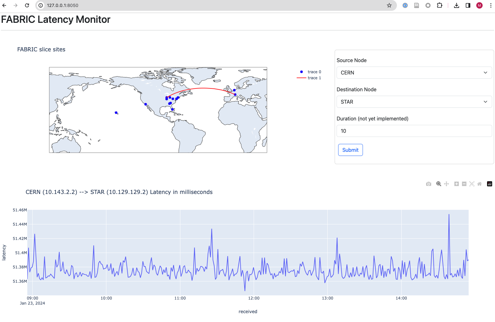

# latency-dashboard

## Purpose

A simple demo to view [FABRIC Measurement Framework OWL](
https://github.com/fabric-testbed/MeasurementFramework/tree/main/user_services/owl)
data using a csv file downloaded from InfluxDB and 2 other resource information
files.

## Usage

```
# First time only
python3 -m venv venv


source venv/bin/activate

# If necesssary
pip install -r requirements.txt

python app.py
```

Then, connect to `http://127.0.0.1:8050/`


## Required Files

- `./data/sites.csv`: FABRIC sites latitudes and longitudes
- `./data/slice.csv`: Information on the FABRIC slice used for this data collection
- `influxdb.conf`: For downloading a csv file using API.


### influxDB config file format (`influxdb.conf`)

```
[InfluxDB]
org = RC
host = https://us-east-1-1.aws.cloud2.influxdata.com
database = <database name>
language = sql
token = <token string>
```

### CSV File Format
```
==> data.csv <== (downloaded from InfluxDB via an API call)
2665687,1706630111.414805,"10.131.1.2","10.129.129.2",857,2024-01-30 15:55:11.412139313
2627255,1706630171.41507,"10.131.1.2","10.129.129.2",858,2024-01-30 15:56:11.412442745
2692427,1706630231.415491,"10.131.1.2","10.129.129.2",859,2024-01-30 15:57:11.412798573
2654862,1706630291.41572,"10.131.1.2","10.129.129.2",860,2024-01-30 15:58:11.413065138
2646703,1706630351.416012,"10.131.1.2","10.129.129.2",861,2024-01-30 15:59:11.413365297
2652645,1706630411.416304,"10.131.1.2","10.129.129.2",862,2024-01-30 16:00:11.413651355
2661005,1706630471.416582,"10.131.1.2","10.129.129.2",863,2024-01-30 16:01:11.413920995
2651402,1706630531.416904,"10.131.1.2","10.129.129.2",864,2024-01-30 16:02:11.414252598
2636192,1706630591.417073,"10.131.1.2","10.129.129.2",865,2024-01-30 16:03:11.414436808
2633540,1706630651.417322,"10.131.1.2","10.129.129.2",866,2024-01-30 16:04:11.414688460

==> sites.csv <==
site,lat,lon
HAWI,21.29897615,-157.81639907976145
EDUKY,38.0325,-84.502801
GATECH,33.7753991,-84.3875488
NEWY,40.7383575,-73.9992012

==> slice.csv <==
site,node_name,ip_address
STAR,node0,10.129.129.2
MICH,node1,10.131.1.2
GATECH,node2,10.136.129.2
CERN,node3,10.143.2.2
```

## Interface

