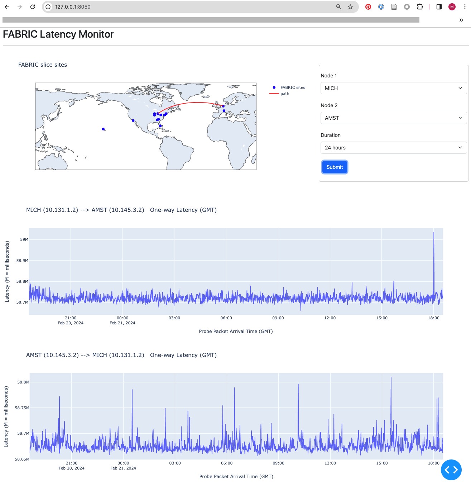

# latency-dashboard

## Purpose

A simple demo to view [FABRIC Measurement Framework OWL](
https://github.com/fabric-testbed/MeasurementFramework/tree/main/user_services/owl)
data using a csv file downloaded from InfluxDB and 2 other resource information
files.

## Usage

```
# First time only
python3 -m venv venv


source venv/bin/activate

# If necesssary
pip install -r requirements.txt

python app.py
```

Then, connect to `http://127.0.0.1:8050/`


## Required Files

- `./data/sites.csv`: FABRIC sites latitudes and longitudes
- `./data/slice.csv`: Information on the FABRIC slice used for this data collection
- `influxdb.conf`: For downloading a csv file using API.


### influxDB config file format (`influxdb.conf`)

```
[InfluxDB]
org = RC
host = <cloud InfluxDB URL (e.g. https://us-east-1-1.aws.cloud2.influxdata.com)>
database = <database name>
language = sql
token = <token string>
```

### CSV File Format
```
==> sites.csv <==
site,lat,lon
HAWI,21.29897615,-157.81639907976145
EDUKY,38.0325,-84.502801
GATECH,33.7753991,-84.3875488
NEWY,40.7383575,-73.9992012

==> slice.csv <==
site,node_name,ip_address
STAR,node0,10.129.129.2
MICH,node1,10.131.1.2
GATECH,node2,10.136.129.2
CERN,node3,10.143.2.2
```

## Interface

